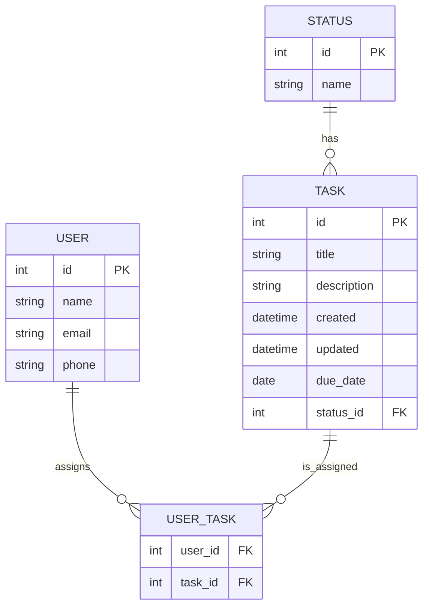

# Assignment

In this assignment, you'll practice working with the task management database you created in the session.
You will be inserting and updating data, writing queries, querying relationships, and finally modify the database schema to add new functionality.

## Getting Started

> [!TIP]
> If problems arise, remember you can ask on Slack for help.

After the session, you should have ended up with a working `tasks.sqlite3` in your assignment repo. It should mirror the following structure:



You will use this database to complete the following assignment tasks.

## Part 1: Basic CRUD Operations

Write SQL queries to perform the following operations:

1. Insert a new user with your own name and email
2. Insert a new task assigned to yourself with the following attributes:
   - Title: "Learn SQL"
   - Description: "Practice database queries"
   - Status: "In Progress"
   - Due date: One week from today
3. Update the title of the task you just created to "Master SQL Basics"
4. Change the due date of your task to two weeks from today
5. Change the status of your task to "Done"
6. Delete one of the tasks in the database (choose any task)

For each operation, save your SQL query in a text file.

## Part 2: Working with Relationships

Write SQL queries to answer the following questions:

1. List all users who don't have any tasks assigned
1. Find all tasks with a status of "Done"
1. Find all overdue tasks (due_date is earlier than today)

## Part 3: Modifying the Database Schema

Now let's modify our database structure to add more functionality:

1. Add a new column called `priority` to the `task` table with possible values: 'Low', 'Medium', 'High'. 💡 Remember to provide default values.
2. Update some existing tasks to have different priority values
3. Create a new table called `category` with columns:
   - id (PRIMARY KEY)
   - name (e.g., "Work", "Personal", "Study")
   - color (e.g., "red", "blue", "green")
4. Create a linking table called `task_category` to establish a many-to-many relationship between tasks and categories:
   - task_id (FOREIGN KEY to task.id)
   - category_id (FOREIGN KEY to category.id)
5. Insert at least 3 categories
6. Assign categories to at least 5 different tasks

## Part 4: Advanced Queries

Now that you've enhanced the database, write queries to:

1. Find all tasks in a specific category (e.g., "Work")
2. List tasks ordered by priority (High to Low) and by due date (earliest first)
3. Find which category has the most tasks
4. Get all high priority tasks that are either "In Progress" or "To Do"
5. Find users who have tasks in more than one category

## Submission

Submit your assignment as a single .sql file containing all your queries, clearly labeled with comments indicating which part and question each query addresses.

Example:

```sql
-- Part 1, Question 1: Insert a new user
INSERT INTO user (name, email, phone) VALUES ('My Name', 'my_email@example.com', '123-456-7890');

-- Part 1, Question 2: Insert a new task
INSERT INTO task (title, description, created, updated, due_date, status_id)
VALUES ('Learn SQL', 'Practice database queries', datetime('now'), datetime('now'), date('now', '+7 days'), 2);
```
