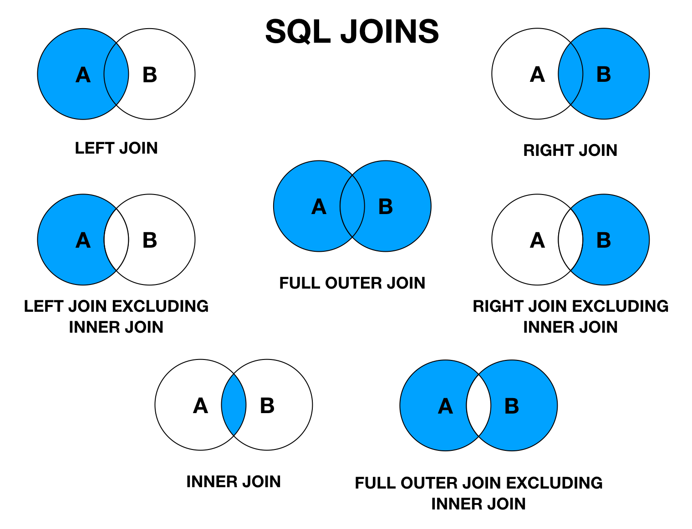

# Session Plan

- Focus on practical modeling exercises and SQL practice
- Ensure trainees understand how to translate business requirements into database structures
- Emphasize database design principles and when to use different relationships
- Build toward the assignment step by step

## Table of Contents

1. The main idea is to start with a requirement
2. Build the Entity-Relationship Diagram (ERD) the trainees
3. Translate the ERD into SQL statements
   - See the limitations of the initial design
4. Introduce foreign keys (status)
   - Add many-to-many relationships (user-task)
5. Practice querying relationships
6. Let the trainees practice designing a database based on [articles_example.json](session-materials/articles_example.json)

## Mentor teaching notes

### Teaching formats

- **DEMO** = Mentor shows on screen, trainees observe
- **EXERCISE** = Trainees work on their own machines

### Exercises solution

The demos and exercises in this session build on top of each other, and a working solution is required for the assignment and going into Week 2. If, for whatever reason, you need a final working solution for yourself or to help a trainee, you can run the following:

```shell
sqlite3 tasks.sqlite3 < session-materials/tasks-solution.sql
```

## Entity-Relationship Modeling

### What is an ERD and why do we use it?

- Entities, attributes, relationships
- Types of relationships (1:1, 1:M, M:M)
- Primary keys and foreign keys

### DEMO: ERD Task Management System

- Mentor leads ERD creation with trainees input using Excalidraw/Draw.io
- Ask trainees to suggest entities, attributes, and relationships

**Scenario**: Design a simple task management system with these requirements:

- Users can have multiple tasks
- Tasks have a title, description, and due date
- Tasks can have one of three statuses: "Not started", "In progress", "Done"
- Each task is assigned to exactly one user

## Translating ERDs to Database Schema

### DEMO: Moving from conceptual to physical model

- How do you actually store this in a database?
- Tables, columns, constraints
- Data types in SQL
- Normalization basics (focus up to 3rd normal form)
  - Example: move `status` to a separate table to avoid redundancy

### EXERCISE 1: Database Creation (10/15 minutes)

Trainees should now create their own `tasks.sqlite3` database under the `databases/database` directory in their assignment repo. Using the ERD from the previous exercise, trainees need to write suitable CREATE TABLE statements for storing users and tasks with statuses.

```sql
CREATE TABLE user (
  id INTEGER PRIMARY KEY AUTOINCREMENT,
  name TEXT NOT NULL,
  -- Your columns here
);

CREATE TABLE task (
  id INTEGER PRIMARY KEY AUTOINCREMENT,
  -- Your columns here
);
```

**Hints:**

- Use INTEGER PRIMARY KEY for IDs
- Don't forget NOT NULL constraints
- created DATETIME NOT NULL,

- Use appropriate data types (TEXT, INTEGER, DATETIME)

### DEMO: Database creation solution

<details>
<summary>Mentor shows the complete solution</summary>

```shell
# Create a new SQLite database file or use a GUI tool
touch tasks.sqlite3

# Create users table
CREATE TABLE user (
  id INTEGER PRIMARY KEY AUTOINCREMENT,
  name TEXT NOT NULL,
  email TEXT NOT NULL,
  phone TEXT
);

CREATE TABLE task (
  id INTEGER PRIMARY KEY AUTOINCREMENT,
  title TEXT NOT NULL,
  description TEXT,
  created DATETIME NOT NULL,
  updated DATETIME NOT NULL,
  due_date DATETIME,
  status TEXT NOT NULL
);
```

</details>

#### Add some sample data

```sql
INSERT INTO user (name, email, phone) VALUES
  ('John Doe', '', '+4512345678'),
  ('Jane Smith', 'jane@gmail.com', '+4512345679');

INSERT INTO task (title, description, created, updated, due_date, status) VALUES
  ('Study SQL Queries', 'Practice writing SQL queries for data retrieval', datetime('now'), datetime('now'), '2025-08-02', 'Done'),
  ('Learn Database Design', 'Study ER modeling and normalization', datetime('now'), datetime('now'), '2025-08-10', 'Not started'),
  ('Write Unit Tests', 'Add test coverage for user authentication', datetime('now'), datetime('now'), '2025-08-05', 'Not started'),
  ('Deploy Application', 'Set up production environment', datetime('now'), datetime('now'), '2025-08-20', 'Not started');
```

At this moment, the database works but... is not very useful. 😅 It still has some limitations.

1. The status is repeated in every task
2. The users are not linked to tasks.

> ![NOTE]
> Ask trainees for possible improvements.

## Defining Relationships

### DEMO: Understanding Foreign Keys and Relationships

**Key concepts:**

- Foreign keys maintain data integrity
- Many-to-many relationships require linking tables
- JOINs connect related data across tables

The steps we will take:

#### 1. Move `status` to a separate table to avoid redundancy

```sql
CREATE TABLE status (
  id INTEGER PRIMARY KEY AUTOINCREMENT,
  name TEXT NOT NULL UNIQUE
);

-- Insert initial statuses
INSERT INTO status (name) VALUES ('Not started'), ('In progress'), ('Done');

-- Modify task table to use status_id
ALTER TABLE task ADD COLUMN status_id INTEGER REFERENCES status(id) DEFAULT 1;

-- Update existing tasks to use status_id
UPDATE task SET status_id = 1 WHERE status = 'Not started';
UPDATE task SET status_id = 2 WHERE status = 'In progress';
UPDATE task SET status_id = 3 WHERE status = 'Done';

-- Finally, remove old status column after migration
ALTER TABLE task DROP COLUMN status;
```

> [!IMPORTANT]
> What we have done:
>
> - Created a `status` table to store task statuses. The benefit? Avoids redundancy and allows easy updates
> - Modified the `task` table to reference `status_id` from the `status` table

Normally this is known as [database migrations](https://en.wikipedia.org/wiki/Schema_migration). We'll not cover this in detail, but it's a common practice in real-world applications.

#### 2. Create a linking table for users and tasks to handle many-to-many relationships

```sql
-- Many-to-many relationship between users and tasks
CREATE TABLE user_task (
  user_id INTEGER NOT NULL,
  task_id INTEGER NOT NULL,
  PRIMARY KEY (user_id, task_id),
  FOREIGN KEY (user_id) REFERENCES user(id) ON DELETE CASCADE,
  FOREIGN KEY (task_id) REFERENCES task(id) ON DELETE CASCADE
);

-- Link a user to a task
INSERT INTO user_task (user_id, task_id) VALUES (1, 1);
```

> [!IMPORTANT] > **What we have done:**
>
> - Created an intermediary table called `user_task` to connect users and tasks.
> - This allows a user to have multiple tasks and a task to be assigned to multiple users.

This is usually called a **linking table** or **junction table**. It allows us to represent many-to-many relationships in a relational database. [Wikipedia](<https://en.wikipedia.org/wiki/Many-to-many_(data_model)>)

## Querying Relationships

Now that we have our tables set up, let's practice querying related data.

### DEMO: Querying related data

- Introduction to JOINs (INNER, LEFT)
- Filtering with WHERE clauses
- Using foreign keys effectively

#### Anatomy of a JOIN query

```sql
-- Example: Get all tasks with their status ids
SELECT title, status_id FROM task t;

-- Introducing JOIN to show the status name
SELECT title, status.name FROM task
JOIN status ON task.status_id = status.id;

-- Joining even further to get more information
SELECT task.title, status.name AS status_name, user.name AS user_name
FROM task
JOIN status ON task.status_id = status.id
JOIN user_task ON task.id = user_task.task_id
JOIN user ON user_task.user_id = user.id
WHERE user.phone LIKE '+45%'; -- Filter by phone number starting with +45
```

> ![IMPORTANT] > **What we have done:**
> Used JOINs to connect related tables:
>
> - `JOIN` connects the tables
> - `ON` specifies how they are related (foreign keys)
> - `SELECT` retrieves specific columns from both tables
> - `AS` allows renaming columns for clarity

Why does the query return only 1 row?
The default `JOIN` is an **INNER JOIN**, which only **returns rows where there is a match in both tables**.

It's good to know there are several types of JOINs: 

### EXERCISE 3: Practice more advanced queries (15 minutes)

Point the trainees to the sample data `tasks-sample-data.sql` in their assignment repo. They should run these commands to insert the data required for the following exercises.

**Trainees practice writing these queries using the sample data:**

1. Get all tasks assigned to a specific user name.
2. Find all users working on the task 'Deploy to production'
3. Find how many tasks each user is responsible for. Hint: `COUNT(), GROUP BY`
4. Find how many completed tasks each user has. Order them in descending order.

### DEMO: Show the solution

<details><summary>Queries solution</summary>

```sql
-- 1. Get all tasks assigned to 'John Doe'
SELECT t.title, t.description, s.name AS status
FROM task t
JOIN user_task ut ON t.id = ut.task_id
JOIN user u ON ut.user_id = u.id
JOIN status s ON t.status_id = s.id
WHERE u.name = 'John Doe';

-- 2. Find all users working on 'Deploy Application'
-- #TODO - Add more users working on this task
SELECT u.name
FROM user u
JOIN user_task ut ON u.id = ut.user_id
JOIN task t ON ut.task_id = t.id
WHERE t.title = 'Deploy Application';

-- 3. Find how many tasks each user is responsible for
SELECT u.name, COUNT(ut.task_id) AS task_count
FROM user u
LEFT JOIN user_task ut ON u.id = ut.user_id
GROUP BY u.name;

-- 4. Find how many completed tasks each user has
SELECT u.name, COUNT(t.id) AS completed_tasks
FROM user u
LEFT JOIN user_task ut ON u.id = ut.user_id
LEFT JOIN task t ON ut.task_id = t.id AND t.status_id = 3
GROUP BY u.name -- Show what happens if we comment this line
ORDER BY completed_tasks DESC;
```

</details>

## EXERCISE 4: Design and implement a database for existing data

Design an ER model and implement the respective database for the data in [this file](session-materials/articles_example.json).

Remember:

- Don't worry if you can't do every step perfectly.
- The important thing is to understand the main ideas.
- Take your time and ask questions if you're confused.

### Steps

1. Analyze the JSON structure
2. Identify entities and relationships
3. Create an ERD
4. Translate to CREATE TABLE statements
5. Insert sample data
6. Write queries to retrieve information
