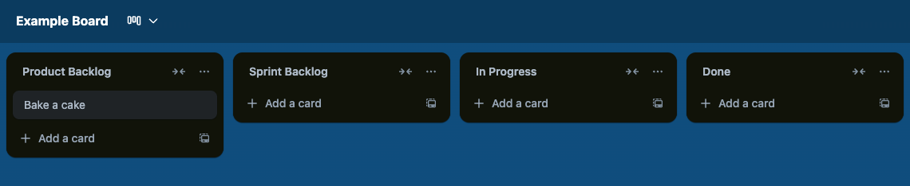
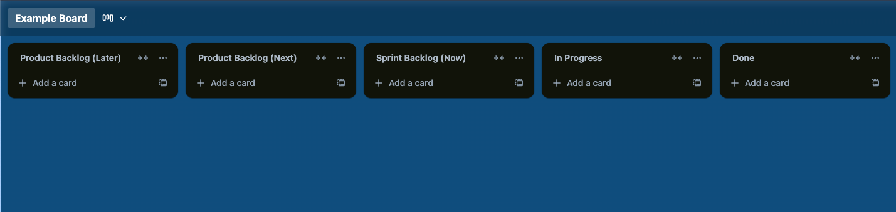

# Session Plan

## Session Outline

1. What is project management?
2. What is Agile (basic principles and values)?
3. Basics of Scrum
4. Simple project setup
5. Simple prioritisation

**Note:** This module is in Foundation, which means trainees are not becoming
specialized developers yet. The above topics should be kept high-level, focusing
on the principles rather than deeper details. For example, it's good to explain
that a principle of Scrum is that decisions are made based on data, but there is
no need to go into the depths of calculating velocity and burndown charts at
this point. These full details should be covered more in the specialization
courses.

## What is project management?

We organise projects to help provide some structure for a group of people to achieve some shared goal by working together.

Project management describes different best practices and approaches we can take to organising some work to avoid wasting time, effort, resources, money, and most importantly end up building the thing we started out to achieve.

Imagine you're about to go on a hike with a group of friends. Project management means you have a map and a plan before you set off, and to help you as you go on. You need to know:

- What path you'll take around the mountain
- What your end destination is
- How you'll get there
- What you need to pack
- Who will carry what along the way

Without project management, even a clever bunch of people can go in the wrong direction, duplicate work, miss deadlines, or build entirely the wrong thing.

Good project management keeps everyone aligned, on the same page, tackles problems early, and gives everyone the best chance of achieving the shared goal together.

## What is Agile

In project management, it's easy to go overboard. Planning every tiny detail of every project up front before actually getting started. This approach is often referred to as Waterfall, since you must complete each step of a project before moving onto the next (e.g. planning, designing, building, testing, delivery). In reality, projects rarely work that way. Lots of details change as you go, as you learn more of how something should work or look. And it's rarely a good idea to leave testing until you've finished building everything!

Agile is a way of working that was born out of a frustration with traditional project management (that followed the Waterfall mentality).

Agile aims to help teams build things in small steps, learn as they go, and adapt when things change. At its core, Agile is about people, collaboration, and delivering value early and often. It helps you avoid following strict processes or writing long plans up front.

Imagine you're steering a boat over a huge ocean. You can't know exactly how the weather will be, so you can't make an accurate plan for the whole journey. Instead, you keep moving forward, regularly checking the weather, your direction, and adjusting your course as needed. This is the Agile approach!

### The 4 Agile principles

Agile was formalised in the Agile Manifesto in 2001 by these core principles, and they are still valued today.

1. Individuals and interactions over processes and tools

Great teamwork and communication matter more than having the “perfect” tool or following every process step.

2. Working software over comprehensive documentation

The most important thing is to deliver something that actually works, and avoid spending too much time writing lots of plans.

3. Customer collaboration over contract negotiation

Working closely with customers throughout the project is more important than delivering just what they agree on at the start.

4. Responding to change over following a plan

Plans are useful, but things change. Be open minded to new ideas, feedback and issues that arise, rather than stubbornly sticking to a plan.

### Exercise: Draw a Rocket

Purpose: Demonstrate the difference between a waterfall and agile approach, showing how feedback and iteration improve results.

Time: 10 minutes

How it works:

1. Ask for a volunteer to be the "customer" and ask for a rocket to be drawn
2. In Waterfall style: The "artist" (mentor) draws a rocket without showing the customer until it's finished. The requester gives feedback of what they like/don't like at the end.
3. In Agile style: The "artist" (mentor) shows progress as they go (first the body, nose tip, wings, windows, flames etc.), asking questions and getting feedback during each step.

Compare the results. The Agile version should fit the customer's vision a lot more closely. Discuss what happened, which turned out better and why.

## Basics of Scrum

Agile is a useful mindset, but it doesn't actually give you any clear instructions on how to run a project. That's where Scrum comes in.

Think of Agile like the philosophy of healthy eating, and Scrum is a specific diet plan to achieve it.

Scrum is defined by some principles, specific roles, specific meetings and "artifacts". We will only go over the basics here, for what you'll need to understand to run your own first project.

### The Sprint

A sprint is a short, fixed period of time (usually 1–4 weeks) where a team focuses on completing a small, specific set of tasks that work towards a bigger goal. The outcome from a sprint should be a working version of the software - in other words, you should aim to finish something specific!

### The Backlog

This contains a list of tasks that you need to complete as part of the project. It is split into two parts, the "product backlog" which contains the full list of tasks, and then a "sprint backlog" which contains the list of tasks that you plan to work on in the next sprint.

## Simple project setup

Let's see what a basic Scrum project might look like in real life!

What we need:

1. A place to define tasks
2. A list of tasks to complete
3. A way to visualise them, so we can see their status

### Demonstration

Walk through the process of setting up a new board on Trello. Make sure to include:

1. A product backlog
2. A sprint backlog
3. In progress and Done columns, too
4. An example task
5. Visually demonstrate how the task moves through the board

It should look something like this:

### Exercise: Setting up Trello

Purpose: To practice setting up a project from scratch

Time: 10 minutes

Trainees should now register and set up their own Trello board. It should mirror what has already been demo'd in the session.

We'll now plan your next birthday party! Add the following tasks to the product backlog:

- Buy decorations
- Order the birthday cake
- Send out invitations
- Book the venue
- Choose and buy party snacks
- Plan the playlist / music
- Plan the date

Notice anything? They order doesn't seem to make sense!

## Prioritising tasks

If you plan of all the tasks you need to complete in a specific project, the list could be very long! And it can be hard to work out where to start.

There are many techniques you can use to help ordering the tasks into a prioritised list. We'll start simple with a method called Now/Next/Later:

- **Now**: We need to do these first.

- **Next**: These are also important, so we'll come to them shortly.

- **Later**: These could be good ideas, but they're not important right now.

How will we visualise that on the board? There is no right answer, as long as it's clear. But here is one way to do it:

### Exercise: Prioritising birthday tasks

Purpose: Practice prioritising a list of tasks using Now/Next/Later.

Time: 10 minutes

With the person next to you, go through the birthday party tasks, and decide which ones should fit into which category. Order your product backlogs so the Now tasks are at the top, followed by the Next, and finally at the bottom the Later tasks.

Finally, get ready to start your first sprint. Move all of the Now tasks into your sprint backlog!

Discuss the order and any differences between people's decisions in the whole group.
